# 配信に必要なソフトと手順書

- [配信に必要なソフトと手順書](#配信に必要なソフトと手順書)
  - [必要なソフト](#必要なソフト)
  - [OBSの導入方法](#obsの導入方法)
    - [1. OBSのインストール](#1-obsのインストール)
    - [2. OBSの画面説明](#2-obsの画面説明)
    - [3. OBSの設定](#3-obsの設定)
      - [シーンの作成](#シーンの作成)
      - [ソースの説明](#ソースの説明)
      - [使用上注意する必要のあるソース](#使用上注意する必要のあるソース)
      - [ソースの設定](#ソースの設定)
        - [1. ゲーム画面の出力](#1-ゲーム画面の出力)
        - [ゲーム画面の表示](#ゲーム画面の表示)
        - [2. ゲーム音声の出力](#2-ゲーム音声の出力)
        - [3. マイクの出力](#3-マイクの出力)
  - [配信方法](#配信方法)

## 必要なソフト

- OBS（Open Broadcaster Software）
  - https://obsproject.com/ja/download
- CastCraft
  - https://castcraft.live/download/
- 棒読みちゃん
  - https://chi.usamimi.info/Program/Application/BouyomiChan/#Download

```text
※ 手順の中でダウンロードするのでここでダウンロードしなくても大丈夫です。
```

## OBSの導入方法

### 1. OBSのインストール

- まずはライブ配信用ソフトのOBSをダウンロードします。以下のリンクをクリックしてください。
  - [OBS（Open Broadcaster Software）]((https://obsproject.com/ja/download))

- OBSの公式サイトが開かれるので①の「ダウンロード インストーラ」部分をクリックする。

  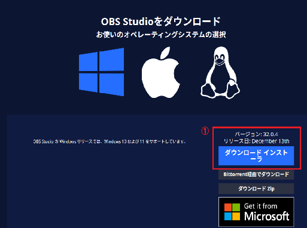

- クリックすると「Thank you for downloading OBS Studio!」と言う文字列が表示されて自動的にダウンロードが開始します。

  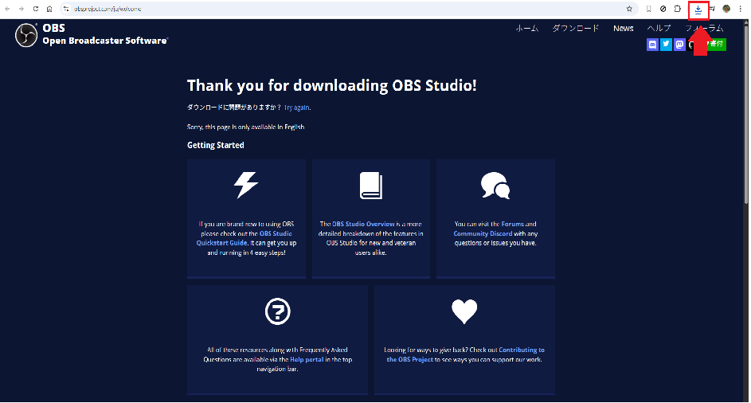

```text
※ 赤い矢印部分をクリックしているとダウンロード状況が確認できます。
```

- 画面下にあるタスクバーの赤い四角で囲まれたアイコン（フォルダアイコン）をクリックする。

  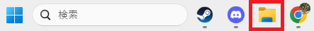

```text
※ タスクバーとは、Windowsパソコンの画面下部（通常）に表示される帯状の領域のこと
```

- フォルダが開かれたら左側に表示されている一覧からダウンロードをクリックする。

  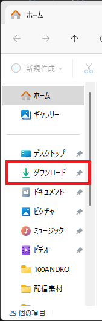

- クリックをすると「OBS-Studio-32.0.4-Windows-x64-Installer.exe」と言うソフトがダウンロードされているのでそのソフトをダブルクリックしてインストールする。

  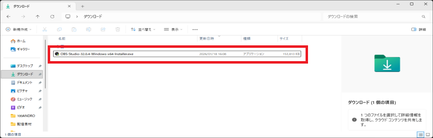

```text
※ 画像の入手が出来ないので割愛「Next >」が表示されたらとりあえずその部分をクリックして問題無いです。
```

### 2. OBSの画面説明

  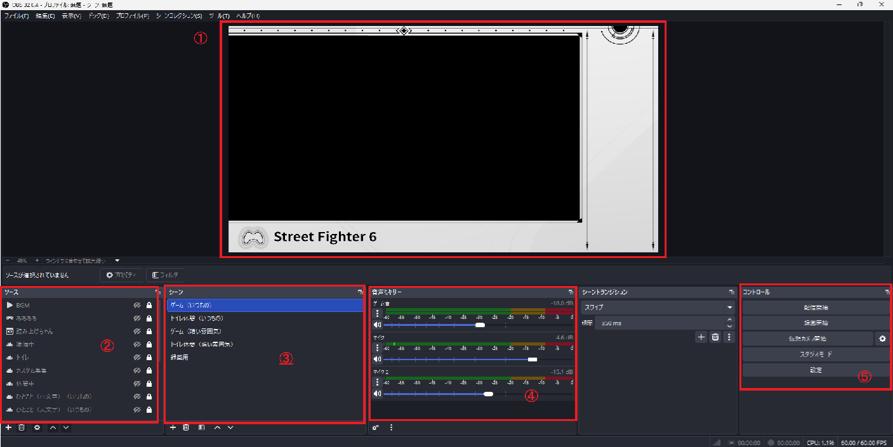

1. 配信画面のプレビュー

   - ②に追加したソースが配信上でどのように見えるか表示してくれる

2. ソース

   - ソースの一覧を表示する領域
   - 画面表示や音声、テキスト等の配信上に載せたい部分を1つずつ追加して何を配信上に載せるか設定する場所

3. シーン

   - ソースをひとまとめにしたもの
   - 作っておいたシーンをクリックするだけで配信上に載せるソースを変更できる
   - 配信の雰囲気に合わせて切り替えたり、待機画面を表示させたりする時に使用する

  ```text
    例. 以下のようにシーンの選択をするだけでソースの中身が変わるので作っておけば簡単に配信画面を変えることが出来る
  ```

  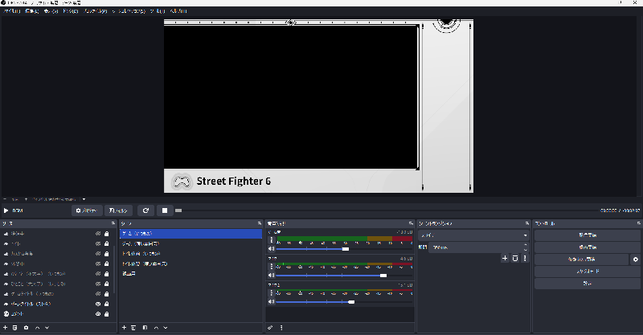

  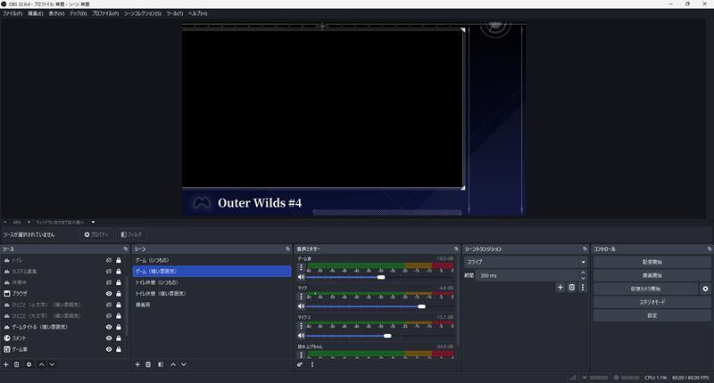

4. 音量ミキサー

   - 追加した音声系のソースやマイクのボリュームを設定する機能

5. コントロール

   - 配信や動画撮影等を開始する機能

### 3. OBSの設定

#### シーンの作成

- 初めにシーンを作ります。シーンの左下にある「+」マークをクリックする。

  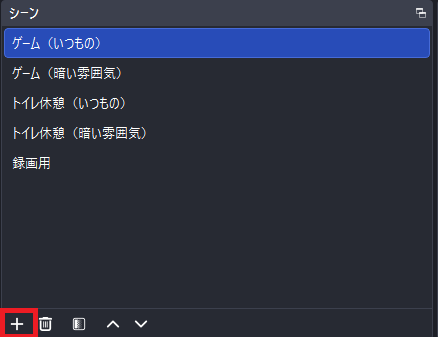

- シーン（ソースをまとめる箱）に任意の名前を付けます。

  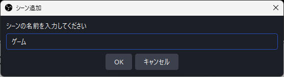

- シーンの部分に「入力した名前」のシーンが出来ていたらOK

  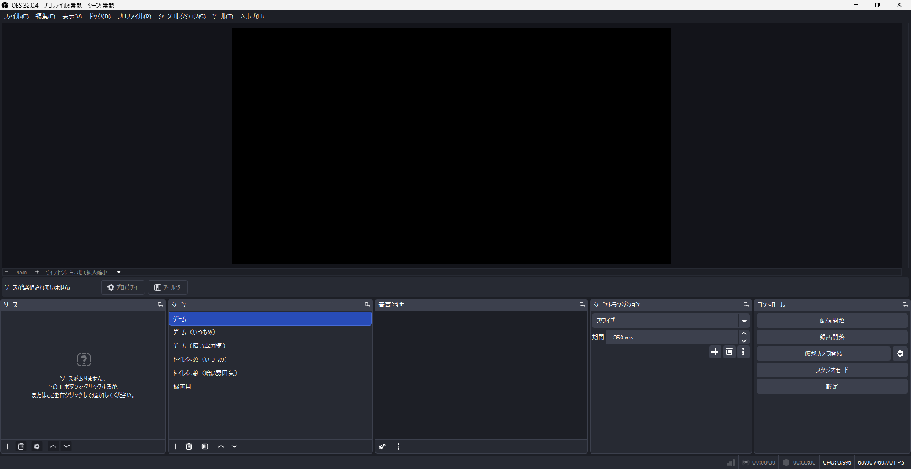

#### ソースの説明

- 初めにソースにある機能でよく使うものを説明します。

　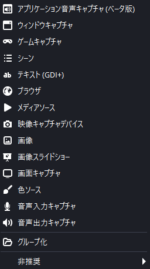

- アプリケーション音声キャプチャ（ベータ版）
  - 音声に関するものを配信に載せるときに使う（ゲーム音やディスコードの音声等）
- ゲームキャプチャ
  - 起動しているゲームを配信に載せるときに使う
- テキスト（GDI+）
  - 文字を書いて配信上に載せるとき
- ブラウザ
  - Google ChromeやMicrosoft Edge等のブラウザを表示する画面
  - URLを入力すると直接画面を表示してくれるのでツイッチのコメントを表示したりするのにも使う
- 画像
  - PC上にある画像を表示する機能
  - よくみる配信画面の枠とかを表示するのために使う

#### 使用上注意する必要のあるソース

- 使用に注意する必要がある機能も説明しておきます
  - 画面キャプチャ
    - PCの画面を「そのまま」表示する機能
    - デスクトップ上にある個人情報等やウィンドウボタンを押した時、フォルダの中にあるファイル等の情報がぽろっと漏れる可能性があるので使用は要注意
  - ブラウザ
    - Google Chromeを開いた瞬間の右上に表示される「ようこそ〇〇さん」や検索履歴、その他もろもろ個人情報が映り込みやすい機能なので注意

```text
※ 機能を一つずつ設定するのは面倒臭いけど、どこで何が漏れるか分からないので「必要なもの」だけ配信に載せるよう気をつけようね
```

#### ソースの設定

- ここでは配信をするために必要な最低機能だけ説明をします。

##### 1. ゲーム画面の出力

- まずはソースの左下にある「+」マークをクリック > ゲームキャプチャを選択する。

  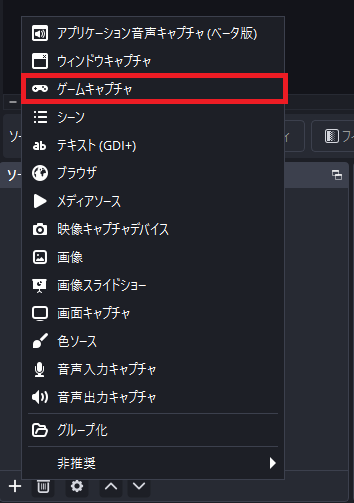

- 「ソースを作成/選択」画面がされます。
- 〇新規作成の下にある入力領域に「ゲーム画面」と入力して、OKボタンをクリックする。
  
  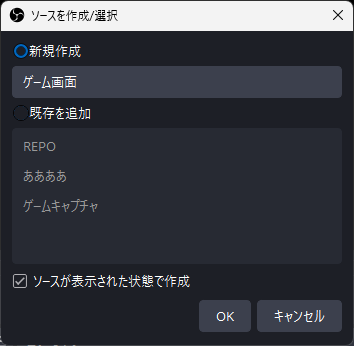

- 'ゲーム画面'のプロパティと言う画面が表示されます。

  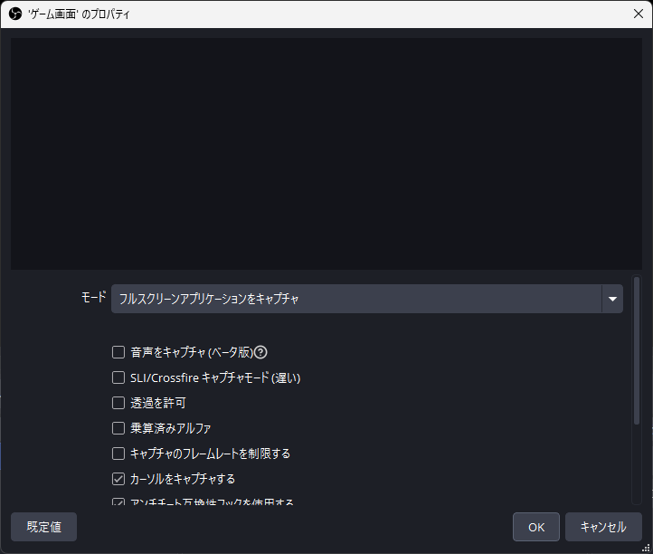

- モード「フルスクリーンアプリケーションをキャプチャ」と書かれたプルダウンリストをクリックして「特定のウィンドウをキャプチャ」を選択する

  

- 以下の画面が表示されるので一旦そのままOKボタンをクリックする

  

- ソースの部分に追加した「ゲーム画面」が表示される

  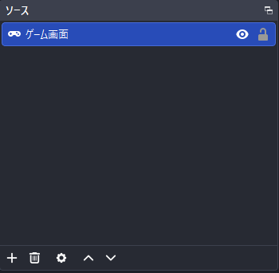

##### ゲーム画面の表示

```text
このゲームキャプチャと言う機能はゲームを起動した時だけ配信画面にゲームを表示してくれる機能です。
実際にゲーム画面を表示してみます。まずは設定してみましょう。
```

- まずはゲームを起動します。

  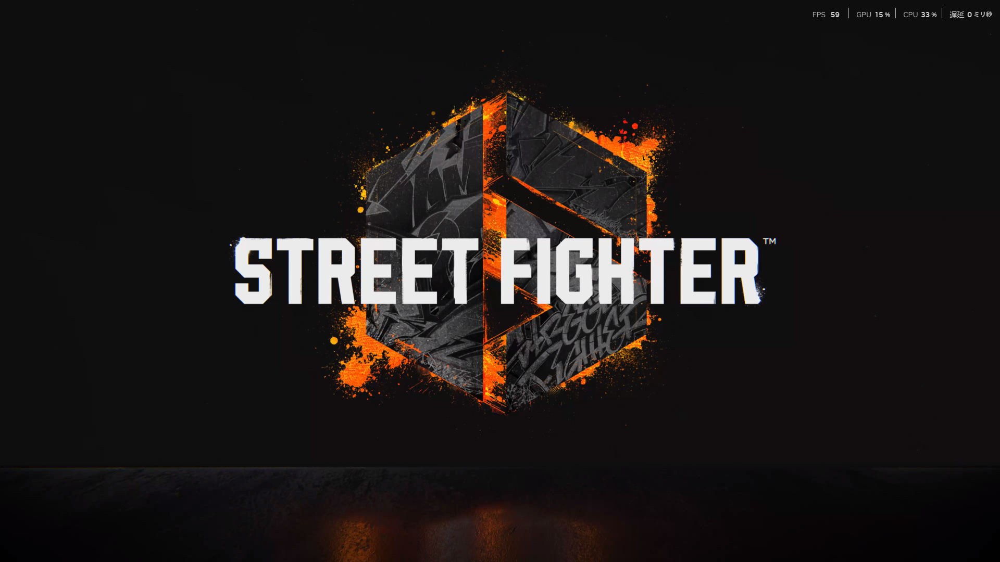

- 次にキーボードのウィンドウボタンを押してOBSを開き直します。

  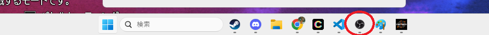

- 次に先ほど作成した「ゲーム画面」をダブルクリックすると先ほどの'ゲーム画面'のプロパティと言う画面が表示されます。

  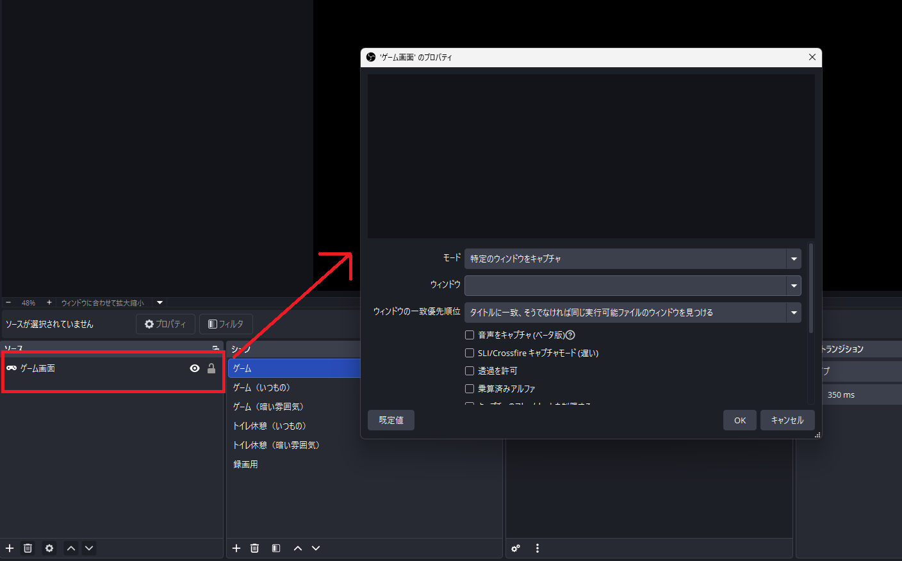

- ウィンドウ > 「\[StreetFighter6.exe\]: StreetFighter6」を選択し、OKボタンを押下する。

  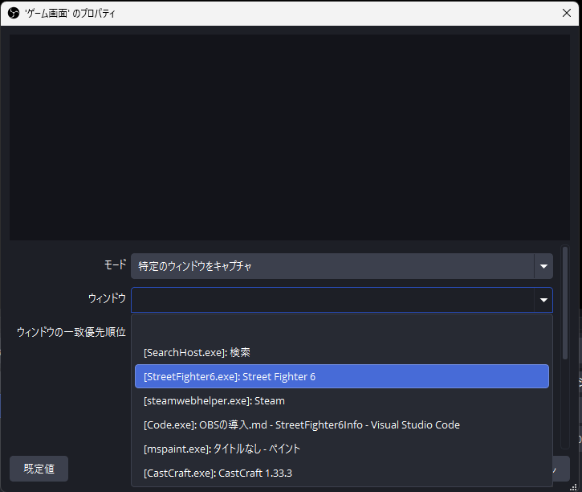

```text
ここで選択するのは配信上に載せたいゲームを選択してください。
```

- 配信のプレビュー画面に「配信したいゲームの画面」が表示されたら完了です。

  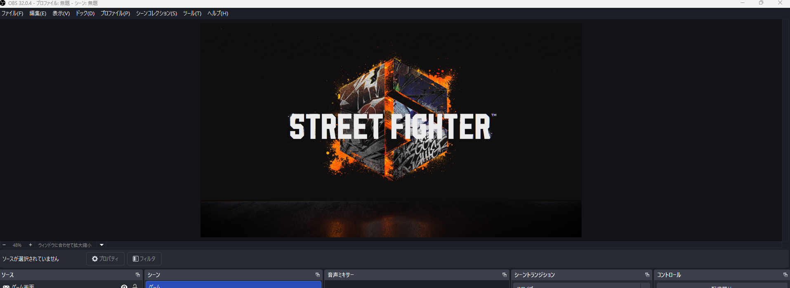

##### 2. ゲーム音声の出力

- まずはソースの左下にある「+」マークをクリック > アプリケーション音声キャプチャ（ベータ版）を選択する。
- 先ほどと同じく、ソースを作成/選択画面が開かれるので「新規作成」の下の入力欄に「ゲーム音声」と入力してOKボタンを押す
- 'ゲーム音声のプロパティ'のプロパティ画面が表示されるのでそのままOKを押す。
- ソース一覧に「ゲーム音声」が追加される
  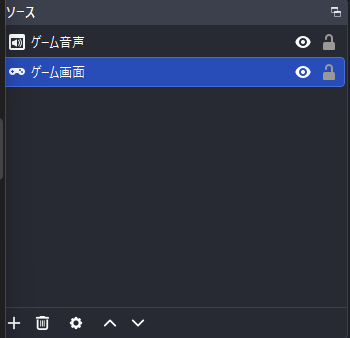

- 先ほどと同じくゲームを起動します。

  

- 次にキーボードのウィンドウボタンを押してOBSを開き直します。

  

- 次に先ほど作成した「ゲーム音声」をダブルクリックすると先ほどの'ゲーム音声'のプロパティと言う画面が表示されます。
- ウィンドウ > 「\[StreetFighter6.exe\]: StreetFighter6」を選択し、OKボタンを押下する。

  

- 音声ミキサーにゲーム音声が追加されていれば完了です。

  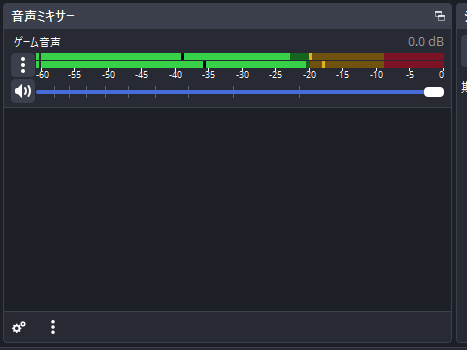

##### 3. マイクの出力

- この章は配信上に自分の声を載せる方法になります。
- まずは画面上部の「ファイル > 設定」をクリックします。

  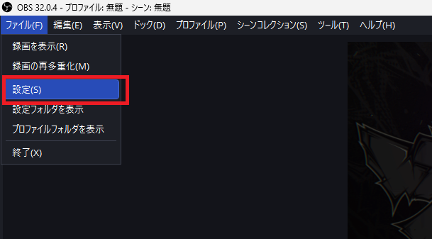

- 設定が面が開かれるので左のリストから「音声」を選択します

  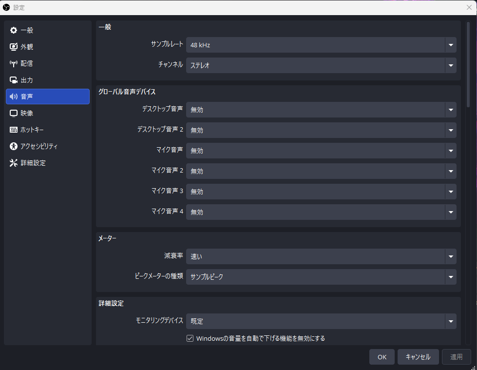

- グローバル音声デバイスと言う項目のマイク音声に自分が使用しているマイクを選択します

  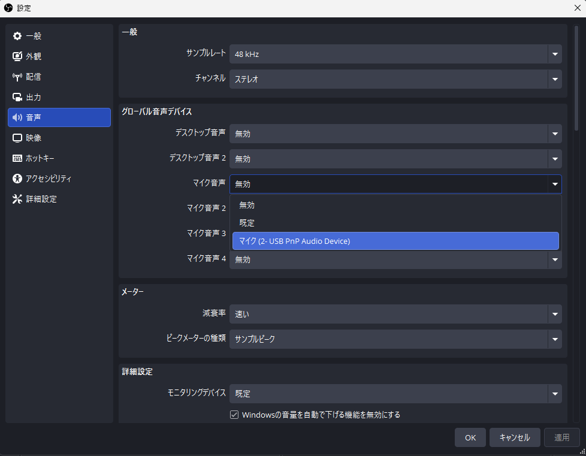

```text
※ それ以外のグローバル音声デバイスの項目は「無効」にしておいてください
```

- 音声ミキサーに「マイク」が追加されていれば完成です。

  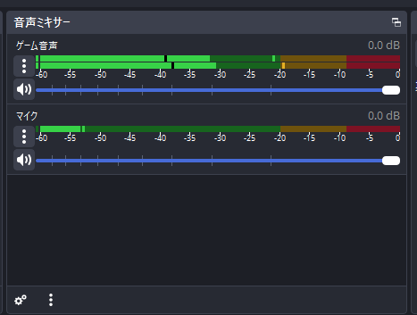

## 配信方法

-　あとはコントロールの「配信開始」ボタンを押せば配信が出来ます。お疲れ様でした。

